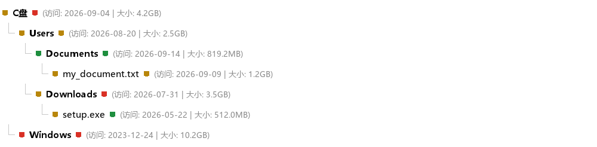
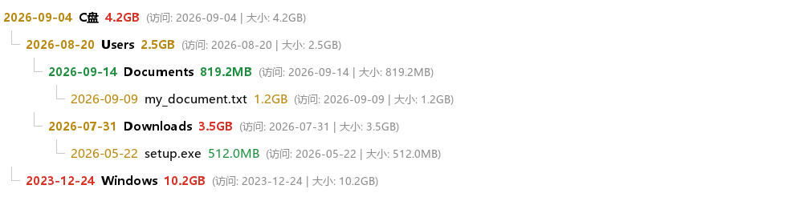
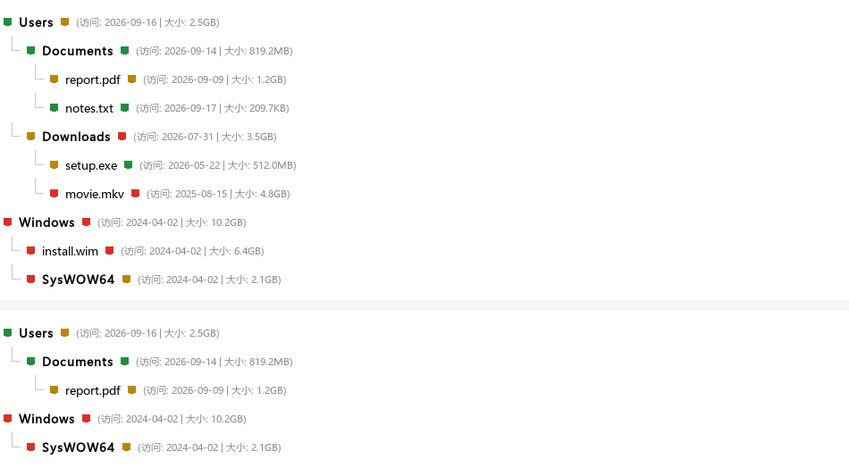

# DiskScanner · 磁盘扫描可视化工具

一个面向 Windows 的磁盘占用分析工具：多线程扫描、树状展示、按颜色快速定位「又大又旧」的文件，
并可直接在界面内完成筛选、排序、复制路径、定位与删除。

> DiskScanner is a Windows disk usage visualizer built with PyQt6. It scans a volume with a
> thread pool, renders the result as a coloured tree, and supports in-place filtering, sorting
> and file operations (copy path / reveal in Explorer / delete to Recycle Bin).

同一个扫描核心还有 [Android 版](#android-版)，用 Kivy + Buildozer 打包成 APK，
由 GitHub Actions 云端构建。

---

## 下载

| 平台 | 文件 | 说明 |
| --- | --- | --- |
| Windows 10/11 | [`DiskScanner.exe`](https://github.com/kkcarft/DiskScanner/releases/download/v1.0.0/DiskScanner.exe) | 单文件绿色版，双击即用，不需要装 Python |
| Android 7.0+ | [`diskscanner-0.1.0-arm64-v8a-debug.apk`](https://github.com/kkcarft/DiskScanner/releases/download/v1.0.0/diskscanner-0.1.0-arm64-v8a-debug.apk) | arm64，18 MB，由 GitHub Actions 云端构建 |
| 全部源码 | [Source code (zip)](https://github.com/kkcarft/DiskScanner/archive/refs/tags/v1.0.0.zip) | 也可以直接 `git clone` |

最新版始终在 [Releases 页面](https://github.com/kkcarft/DiskScanner/releases)。

---

## 界面预览

**色标样式（默认）** —— 两个色块分别表示「时间档位」与「体积档位」，具体数值在灰色括号里：



**带数值样式** —— 彩色段直接写出日期与体积：



**筛选前后** —— 过滤后仍保留树状目录结构，不在范围内的分支整枝隐藏：



---

## 主要功能

### 扫描

- 自动枚举可扫描盘符（跳过光驱与虚拟盘），启动后自动扫描系统盘
- 多线程广度优先扫描，界面不卡死；线程数按 CPU 核数自适应（4~32）
- 遇到无权限、被占用、已消失的目录或文件**一律跳过并计数**，绝不中断扫描
- 自动跳过符号链接与目录联接，避免死循环与重复统计
- 节点数上限可在界面内调整（1 万 ~ 5000 万），触顶时明确提示

### 展示

- 树状结构展示，目录体积自底向上聚合
- **用 `QStyledItemDelegate` 重写 `paint()`**，在同一行内分段着色：
  - 前段色块 = 时间档位：7 天内绿 / 7~180 天黄 / 180 天以上红
  - 后段色块 = 体积档位：小于 1GB 绿 / 1~3GB 黄 / 3GB 以上红
  - 名字之后以灰色小字显示 `(访问: 2025-11-23 | 大小: 2.5GB)`
- 前段指标可切换「最后访问时间」或「修改时间」
- 行内样式可在「色标」与「带数值」之间切换

### 筛选

- 按**体积区间（GB）**与**时间区间（距今天数）**过滤
- 筛选后**保留原有树状目录结构**，不符合条件的文件与文件夹被隐藏
- 目录自身不在范围内、但下级有命中项时，默认保留为「路径」；可切换为严格模式
- 输入防抖 320ms，改条件不会卡界面；一键重置取消筛选

### 排序

- 8 种排序方式：大小 ↓/↑、名称 A→Z / Z→A、时间新→旧 / 旧→新、目录优先、扫描顺序
- 递归作用于全树每个目录
- 使用 `list.sort(key=...)` 而非 `functools.cmp_to_key`，**实测快 6 倍**（见下文）

### 文件操作

- **删除**：默认移入回收站（可恢复），永久删除需在确认框里显式切换；
  删除量大时必须手动键入数量才能确认
- **复制完整路径**：多项目每行一个，空选中时不覆盖剪贴板
- **打开所在位置**：在资源管理器中定位并选中；同目录只开一个窗口

### 选择交互

- **左键拖拽**连续拉选；`Ctrl` 点选多选
- **右键点击**未选中项可将其「加入」当前选择，而不是替换
- **多选窗口**：非模态，列出所有选中项的名称、完整路径、类型、大小、访问时间，
  并支持批量复制路径 / 打开位置 / 删除

### 扫描进度

- 进度条**按能否拿到真实分母自适应切换算法**，不是单一固定方式
- 扫描卷根时用「卷已用字节」作真实分母；聚合与排序阶段总量已知，显示精确进度
- 状态栏常驻实时数据：已扫描体积、目录数、文件数、跳过数、速率、已用时、剩余时间

---

## 环境要求

| 项目 | 要求 |
|---|---|
| 操作系统 | Windows 10 / 11（删除与「打开所在位置」依赖 Windows API；其余功能跨平台可用） |
| Python | 3.8 及以上（开发时使用 3.13） |
| 运行时依赖 | PyQt6 |
| 打包依赖 | pyinstaller（仅打包时需要） |

---

## 安装与使用

### 方式一：直接运行源码

```bash
pip install PyQt6
python scanner.py
```

### 方式二：一键打包成单文件 EXE

双击 `build.bat`。脚本会自动完成：

1. 定位 Python（`python` 或 `py -3`）并校验版本 ≥ 3.8
2. 检查 pip，必要时用 `ensurepip` 修复
3. 缺什么装什么（PyQt6、pyinstaller）
4. 打包前做语法预检
5. `pyinstaller -F -w` 生成单文件无控制台 EXE 到 `dist\DiskScanner.exe`

产物约 35 MB，无需任何外部依赖，可直接分发。

### 使用说明

1. 启动后自动扫描系统盘；也可在「扫描磁盘」下拉框换盘再点「开始扫描」
2. 颜色规则见界面右上角图例；鼠标悬停任意行可看完整路径与时间戳
3. 用第三行工具栏的区间输入筛选，用第二行切换排序与前段指标
4. 选中若干行后可点「查看选中」打开多选窗口做批量操作

> 扫描 `C:\` 的系统目录建议右键 EXE 用管理员身份运行，能少跳过一些目录。

---

## 设计要点

### 排序：为什么必须用 `key=` 而不是 `cmp_to_key`

`list.sort(key=...)` 由 Timsort 排序，**每个元素只调用一次** key 函数；而
`functools.cmp_to_key` 每次比较都要回到 Python 层，调用次数是 O(n·log n)。
16 万节点（400 目录 × 400 项）实测：

| 实现 | 回调次数 | 耗时 |
|---|---|---|
| `sort(key=...)` | 160,000 | **0.066 s** |
| `cmp_to_key` | 1,177,187 | 0.400 s |

回调多 7.4 倍，耗时慢 6 倍。

### 筛选：线性且内存友好

`apply_filter()` 只走两遍线性遍历（后序标记可见性 + 前序生成可见子列表），
并且**只有确有子项被隐藏的目录**才分配额外列表；没有筛选时退化为直接使用原列表，
零额外内存、零额外开销。

### 进度：诚实地展示，不编数字

扫描前无法知道总条目数（先数一遍就得遍历一遍，实测两遍法要 1.9~2.25 倍时间）。
而基于 BFS 前沿的估算在真实文件系统上会崩：`C:\Windows\System32` 下存在含
10,725 个子目录的目录，待处理目录数会从 2 瞬间涨到 10,725，估算百分比随之从 99% 跌到 0.1%。

因此进度模型按「能否拿到真实分母」自适应：

| 扫描目标 | 进度语义 | 分母 |
|---|---|---|
| 卷根（`C:\`） | 确定进度 = 已发现字节 ÷ 卷已用字节 | `shutil.disk_usage()` —— 真实分母 |
| 子目录 | 不确定进度 + 密集实时数字 | 无可信分母，不编造百分比 |
| 聚合 / 排序 | 确定进度 | 已发现节点总数（此时已知） |

`C:\` 全盘实测（1,342,782 个条目 / 203.6 GB / 18.3 秒）：平均绝对偏差 18.6%，
全程单调递增，永不倒退、永不卡死。

### 删除：默认走回收站

调用 Windows Shell 的 `SHFileOperationW` + `FOF_ALLOWUNDO`，默认移入回收站可恢复。
路径以列表形式交给系统 API，不经过 shell，因此 `% & ^ ! ' "` 等特殊字符无需转义；
超长路径自动加 `\\?\` 前缀；只读文件先摘掉只读位再删。

---

## 测试

`test_scanner.py` 是无头（offscreen）自动化验证脚本，**当前 285 项断言全部通过**：

```bash
python test_scanner.py
```

覆盖范围：

| 组 | 内容 |
|---|---|
| A | 纯逻辑边界（时间/体积分档、格式化） |
| B | 扫描引擎（真实目录、聚合、排序、无权限跳过、路径不存在） |
| C | 树模型（index/parent/rowCount/role 行为） |
| D | 委托绘制（**逐像素**断言两段颜色与顺序） |
| E | 委托健壮性（极窄行、极端时间戳） |
| F | 主窗口端到端（跨线程信号、模型挂载、控件联动、展开保持） |
| G | 指标切换与节点上限 |
| H | 行内样式（色标 / 带数值） |
| I | 筛选（判据边界、树形保留、严格模式、模型自洽、重置） |
| J | 排序（8 种结果、递归性、算法性能基准） |
| K | 文件操作（纯逻辑 / 真实删除与定位 / 界面联动 / 确认框） |
| L | 扫描进度模型（卷根判定、三阶段合成、单调性、速率与剩余时间） |

测试会在临时目录里创建真实文件并执行真实删除（不含回收站以外的影响），
剪贴板测试前会保存、测试后还原。

`progress_measure.py` 是进度模型的标定工具，可在任意磁盘上测量进度条与实际进展的贴合度：

```bash
python progress_measure.py "C:/"
```

---

## 项目结构

```
DiskScanner/
├─ scanner.py              主程序（单文件：数据层 / 视图层 / 模型层 / 界面层）
├─ build.bat               一键打包脚本
├─ test_scanner.py         无头自动化验证脚本（285 项断言）
├─ progress_measure.py     进度模型标定工具
├─ requirements.txt        运行时依赖
├─ 设计说明.md              完整设计文档（交互流程 / 确认机制 / 边界情况）
├─ sample_marks.png        界面预览：色标样式
├─ sample_values.png       界面预览：带数值样式
├─ sample_filter_compare.png  界面预览：筛选前后对比
├─ android/
│  ├─ corescan.py            扫描核心（从 scanner.py 程序化抽取，纯标准库）
│  ├─ main.py                安卓端 UI（Kivy）
│  ├─ buildozer.spec         打包配置
│  ├─ test_core.py           核心逻辑验证（47 项断言）
│  └─ smoke_ui.py            UI 冒烟测试
└─ .github/workflows/build-android.yml  云端打包 APK
```

---

## Android 版

扫描核心 `android/corescan.py` 是从 `scanner.py` **程序化抽取**出来的，没有手工改写，
所以两个平台扫出来的口径完全一致（体积聚合、时间档位、色标阈值都一样）。
UI 用 Kivy 重写，打包走 Buildozer，在 GitHub Actions 上云端完成。

### 怎么拿到 APK

不用本地装 SDK/NDK（那要 10GB+）。推代码到 `main` 后
[Build Android APK](https://github.com/kkcarft/DiskScanner/actions) 工作流会自动跑，
约 20~40 分钟出包并发布到 Releases；也可以在 Actions 页面手动点 `Run workflow`。

### 和 Windows 版的差异

| 项 | Windows 版 | Android 版 |
| --- | --- | --- |
| 扫描范围 | 选盘符 | 没有盘符概念，直接扫整个共享存储（`/storage/emulated/0`）和外置 SD 卡 |
| 多选 | `Ctrl` / `Shift` | 勾选框 |
| 删除 | 回收站 / 永久删除 | 只有永久删除（安卓没有统一回收站），三层确认 |
| 复制路径 | 系统剪贴板 | 安卓剪贴板（`ClipboardManager`） |
| 打开所在位置 | 有 | 无（安卓没有对应能力） |

### 安卓上的硬限制

- **各 App 的私有数据目录（`/data/data/...`、`/storage/emulated/0/Android/data/...`）枚举不到。**
  这是系统沙箱限制，不是权限没给够 —— 任何第三方 App 都扫不到，包括系统自带的文件管理器。
  所以系统设置里看到的「已用空间」和本工具扫出来的总量会对不上，差的那部分就是私有数据。
- `MANAGE_EXTERNAL_STORAGE` **不允许用弹窗申请**，只能用户自己进
  `系统设置 → 应用 → 存储扫描 → 所有文件访问` 打开。不给也能用，但只能扫到公共目录。
- 删除后会调用 `MediaScannerConnection` 通知系统刷新，否则相册里会残留缩略图。

### 为什么不用 PySide6

PySide6 官方的 `pyside6-android-deploy` 在 PyPI 上并不存在（404），
meta 包里不含任何 Android 产物；`qtpip` 只对商业授权用户提供轮子。
LGPL 用户想用 Qt for Android 得自己在 Linux 上交叉编译 Qt，耗时数小时。
Kivy + Buildozer 是唯一能在 CI 里一键跑通的路子。

---

## 已知限制

- **「访问次数」不存在**：Windows 文件系统只记录「最后访问时间」，没有访问次数字段；
  且部分磁盘默认关闭了访问时间更新，此时会回退用修改时间
- **子目录扫描没有确定百分比**：不预遍历就无法知道总量，界面会诚实显示为不确定进度
- **回收站方式的路径长度上限约 260**（`SHFileOperationW` 受老 Win32 限制），
  超长路径请改用永久删除
- 扫描完成后不自动重新扫描磁盘；在软件外部改动的文件需要重新扫描才会反映
- 符号链接与目录联接在扫描阶段即被跳过，因此不会出现在树里

---

## 许可证

本项目基于 [MIT License](LICENSE) 开源。
